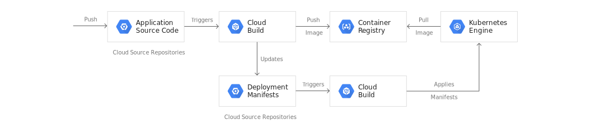
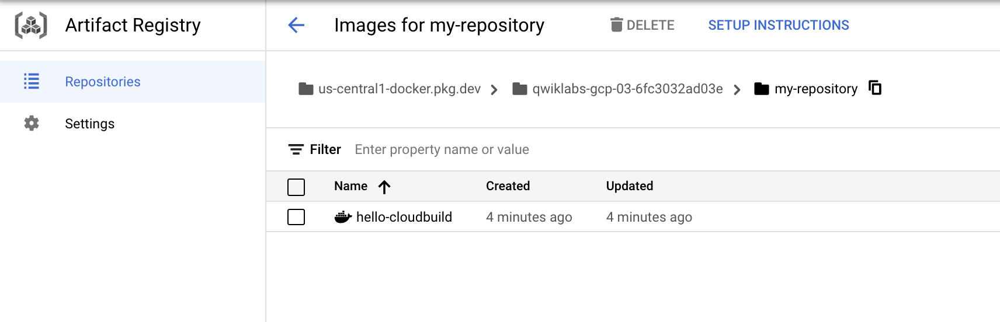
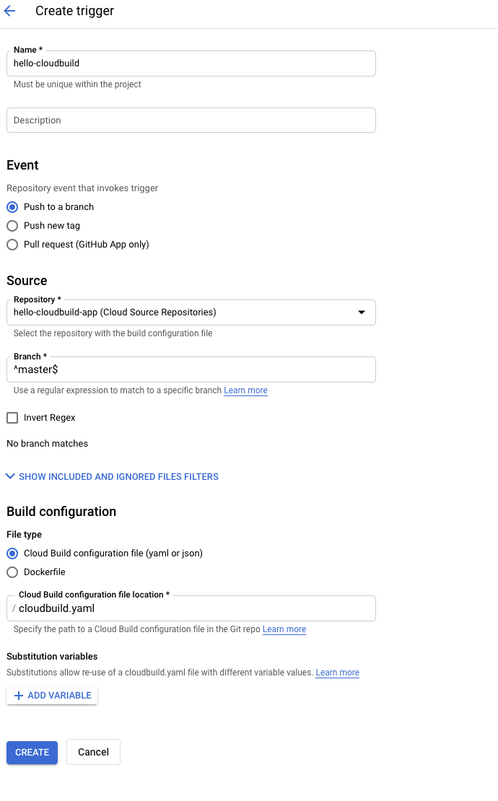
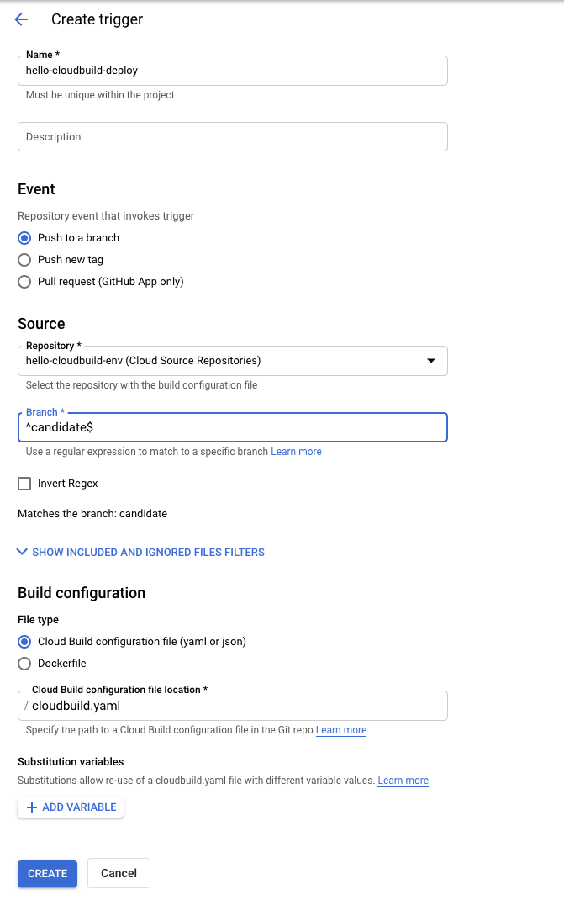

# M5.3 - CI/CD for Google Kubernetes Engine using Cloud Build
This lab is guided and full instructions can be found in the following [link to lab ](https://www.coursera.org/learn/deploying-secure-kubernetes-containers-in-production/ungradedLti/CiFNu/ci-cd-for-google-kubernetes-engine-using-cloud-build).<br>
(May need access to coursera, else search for title for access from Qwiklabs.)<br>
This documentation is an interpreted shortened version of my own attempt at this setup.

---
## Overview


For this demo we'll have 2 repos, each named as follows:
    * app repository: contains the source code of the application itself. main users are humans developers
    * env repository: contains the manifests for the Kubernetes Deployment.  

1. We push changes to "app repo"
2. Cloud Build CI Pipeline is triggered.
3. Cloud Build runs, tests, & build container image & push to Artifact Registry
4. Cloud Build updates deployment manifest and push to "env repo" "candidate" branch.
5. Cloud Build CD Pipeline is triggered.
6. Cloud Build applies manifest to K8s cluster deployment
7. If deployed successfully, manifest is copied to "production" branch.
    * The candidate branch is a history of the deployment attempts.
    * The production branch is a history of the successful deployments.
    * You have a view of successful and failed deployments in Cloud Build.
    * You can rollback to any previous deployment by re-executing the corresponding build in Cloud Build. A rollback also updates the production branch to truthfully reflect the history of deployments.


---
## Objectives
* Create repo in artifact reg.,
* Create repo in Cloud Source Repositories (one for CI, one for CD)
* Create Kubernetes Engine clusters
* Setup Git, conf CSR as a remote, clone sample app, use CloudBuild package image and submit to Artifact Registry
* Trigger Cloud Build from Cloud Source Repositories
* Automate tests and publish a deployable container image via Cloud Build
* Manage resources deployed in a Kubernetes Engine cluster via Cloud Build	
---

## 1. Initialize Your Lab
Enable the APIs for GKE, Cloud Build, Cloud Source Repositories and Container Analysis.
```
gcloud services enable container.googleapis.com \
    cloudbuild.googleapis.com \
    sourcerepo.googleapis.com \
    containeranalysis.googleapis.com
```

Create an Artifact Registry Docker repository "my-repository" to store container images.
```
gcloud artifacts repositories create my-repository \
  --repository-format=docker \
  --location=us-central1
```

Create cluster.
```
gcloud container clusters create hello-cloudbuild \
    --num-nodes 1 --region us-central1
```

Settings for Git.
```
git config --global user.email "student-xx-xxxxxxxx@qwiklabs.net"  
git config --global user.name "Jack"
```
---
## 2. Create the Git repositories in Cloud Source Repositories (app and env)
[GCP Git Guideline](https://cloud.google.com/source-repositories/docs/adding-repositories-as-remotes)<br>
[GCP App Repo used for this demo](https://github.com/GoogleCloudPlatform/gke-gitops-tutorial-cloudbuild)
```
gcloud source repos create hello-cloudbuild-app
gcloud source repos create hello-cloudbuild-env
cd ~
git clone https://github.com/GoogleCloudPlatform/gke-gitops-tutorial-cloudbuild \
    hello-cloudbuild-app
```

Configure Cloud Source Repositories as a remote (alternatively can use Github, Bitbucket...).
```
cd ~/hello-cloudbuild-app
PROJECT_ID=$(gcloud config get-value project)
git remote add google \
    "https://source.developers.google.com/p/${PROJECT_ID}/r/hello-cloudbuild-app"
```
---
## 3. Create a container image with Cloud Build
Here we use Dockerfile to package app image and CloudBuild build based on latest commit.
```
cd ~/hello-cloudbuild-app
COMMIT_ID="$(git rev-parse --short=7 HEAD)"
gcloud builds submit --tag="us-central1-docker.pkg.dev/${PROJECT_ID}/my-repository/hello-cloudbuild:${COMMIT_ID}" .
```

Now to verify container image has been created, go to console and navigate to:
**Artifact Registry** > **Repositories** > **my-repository**.



---
## 4. Create CI Pipeline
CloudBuild run small unit test, build image, push to container reg, all triggered by pushing a commit to CSR.
Create the triggers in console by navigating to **Cloud Build** > **Triggers** > **Create Triggers** .
|Parameters|Value|
|-|-|
|Name|hello-cloudbuild
|Event|push to a branch
|Repository|hello-cloudbuild-app
|Branch|^master$   
|Cloud Build configuration file location|/cloudbuild.yaml|



Push application code to CSR (starts the trigger).
```
cd ~/hello-cloudbuild-app
git status		#check if got modified,yet to commit files,but likely not since we had just cloned the repo
git push google master
```

Navigate to **Cloud Build** > **Dashboard**, and look for the build for recent commit that we had just pushed.


---
## 5. Create the Test Environment and CD Pipeline
CD pipelines runs when: 
1. commit is pushed to candidate branch of the env repository
2. applies new version of manifest to cluster
3. if successful, copies manifest to production branch

Here we modify the continuous integration pipeline to update the candidate branch of the hello-cloudbuild-env repository, triggering the continuous delivery pipeline
But first, Cloud Build needs the "Kubernetes Engine Developer" IAM Role.
```
PROJECT_NUMBER="$(gcloud projects describe ${PROJECT_ID} --format='get(projectNumber)')"
gcloud projects add-iam-policy-binding ${PROJECT_NUMBER} \
    --member=serviceAccount:${PROJECT_NUMBER}@cloudbuild.gserviceaccount.com \
    --role=roles/container.developer
```

Initialize env repo with two branches.
Clone the empty *hello-cloudbuild-env* repository and checkout as the production branch
```
cd ~
gcloud source repos clone hello-cloudbuild-env
cd ~/hello-cloudbuild-env
git checkout -b production
```

Now that we have the two branches and iam permissions, we can push the commit to candidate branch.
`cloudbuild-delivery.yaml` file describes the build process to be run in Cloud Build:
```
cd ~/hello-cloudbuild-env
cp ~/hello-cloudbuild-app/cloudbuild-delivery.yaml ~/hello-cloudbuild-env/cloudbuild.yaml
git status
git add .	##to undo/unstage, git rm --cached <file name>, git reset HEAD does not work here
git commit -m "Create cloudbuild.yaml for deployment"  
```
Checkout as candidate branch. Push the both repo branch to be available in CSR
```
git checkout -b candidate
git push origin production		#push: upload local repository content to a remote repository
git push origin candidate		#git push <remote> <branch>
```

Next, Cloud Build needs the "Source Repository Writer" IAM Role for ONLY the env repo, grant access:
```
PROJECT_NUMBER="$(gcloud projects describe ${PROJECT_ID} \
    --format='get(projectNumber)')"
cat >/tmp/hello-cloudbuild-env-policy.yaml <<EOF
bindings:
- members:
  - serviceAccount:${PROJECT_NUMBER}@cloudbuild.gserviceaccount.com
  role: roles/source.writer
EOF
gcloud source repos set-iam-policy \
    hello-cloudbuild-env /tmp/hello-cloudbuild-env-policy.yaml
```

Now we can create the CD trigger, navigate to **CLoud Build** > **Triggers** > **Create Triggers**:
|Parameters|Value|
|-|-|
|Source Repository|hello-cloudbuild-env|
|Branch|^candidate$|
|Cloud Build configuration file location|/cloudbuild.yaml|



---
## 5.1 Modify CI to trigger CD
The `cloudbuild-trigger-cd.yaml` is an extended version of the `cloudbuild.yaml` file. It adds the steps below: they generate the new Kubernetes manifest and trigger the continuous delivery pipeline. Here we copy the configurations and overwrite into `cloudbuild.yaml`
```
cd ~/hello-cloudbuild-app
cp cloudbuild-trigger-cd.yaml cloudbuild.yaml
cd ~/hello-cloudbuild-app
git add cloudbuild.yaml
git commit -m "Trigger CD pipeline"
git push google master
```
---
## 6. Review CLoud Build Pipeline
Navigate to **Cloud Build** > **Dashboard** > **trigger** > **hello-cloudbuild-app**.


Navigate to **Dashboard**.


---
## 7. Test the complete pipeline
Navigate to **Kubernetes Engine** > **Services & Ingress**, then check for *hello-cloudbuild* in the list. Click on the endpoint for the hello-cloudbuild to get the external IP info. Use browser to identify app is up.

---
## 7.1 Simulate a change in application code
Replace "Hello World" by "Hello Cloud Build", both in the application and in the unit test.
```
cd ~/hello-cloudbuild-app
sed -i 's/Hello World/Hello Cloud Build/g' app.py
sed -i 's/Hello World/Hello Cloud Build/g' test_app.py
```
Commit and push to app to CSR, this should trigger CI pipeline, and subsequently CD pipeline
```
git add app.py test_app.py
git commit -m "Hello Cloud Build"
git push google master
```
Navigate to **Cloud Build** to see the build in progress. After successful build and deployment, the changes should be reflected in the external IP of app.

---
## 8. Test the rollback
Navigate to **Cloud Build** > **Dashboard**. Click on *View all link* under **Build History** for the **hello-cloudbuild-env** repository
Click on the second most recent build available.
Click Rebuild.


Refresh browser and you should see the previous version of app.

---
## END
---