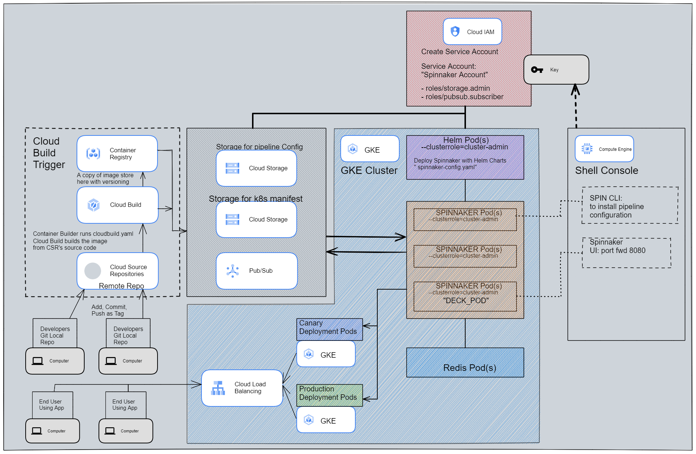

# Quest5 - Continuous Delivery Pipelines with Spinnaker and Kubernetes Engine
This lab is guided and full instructions can be found in the following [link to lab. ](https://www.cloudskillsboost.google/focuses/552?parent=catalog)
This documentation is an interpreted shortened version of my own attempt at this setup.

---
## Summary:	
* Create a Kubernetes Engine cluster, and configuring your identity and user management scheme.
* Download a sample application, create a Git repository then upload it to a Google Cloud Source Repository.
* Deploy Spinnaker to Kubernetes Engine using Helm.
* Build your Docker image.
* Create triggers to create Docker images when your application changes (git push, git tag)
* Configure a Spinnaker pipeline to reliably and continuously deploy your application to Kubernetes Engine.
* Testing: Deploy a code change, triggering the pipeline, and watch it roll out to production.
---		

The following diagram represents the architecture of our continuous delivery pipeline:<br>
<br>
When it comes to diagramming there are popular options like draw.io, but Google provides a really cool [diagramming tool](https://googlecloudcheatsheet.withgoogle.com/architecture) for drawing architectures like this diagram that I've drawn.

---
## Setting up the environment & create Service Accounts
1. spin up resources (default cluster with 3nodes)
```
gcloud config set compute/zone us-central1-f
gcloud container clusters create spinnaker-tutorial \
    --machine-type=n1-standard-2
```
2. For Spinnaker, create appropriate Service Accounts for it and bind it to our project. Also setup IAM (storage admin role) for this SA & download keys(spinnaker-sa.json) into cloud shell for upload later
```
gcloud iam service-accounts create spinnaker-account --display-name spinnaker-account
export SA_EMAIL=$(gcloud iam service-accounts list \
    --filter="displayName:spinnaker-account" \
    --format='value(email)')
export PROJECT=$(gcloud info --format='value(config.project)')
gcloud projects add-iam-policy-binding $PROJECT \
    --role roles/storage.admin \
    --member serviceAccount:$SA_EMAIL
gcloud iam service-accounts keys create spinnaker-sa.json \
     --iam-account $SA_EMAIL
```
---

## Set up Cloud Pub/Sub to trigger Spinnaker pipelines
1. Create topic and subscription. And then give role(pubsub subscriber) to Spinnaker to read sub
```
gcloud pubsub topics create projects/$PROJECT/topics/gcr
gcloud pubsub subscriptions create gcr-triggers --topic projects/${PROJECT}/topics/gcr
export SA_EMAIL=$(gcloud iam service-accounts list \
    --filter="displayName:spinnaker-account" \
    --format='value(email)')
gcloud beta pubsub subscriptions add-iam-policy-binding gcr-triggers \
    --role roles/pubsub.subscriber \
	--member serviceAccount:$SA_EMAIL
```

---
## Deploy Spinnaker using Helm
1. for this demo, we grant Helm cluster-admin role (kubectl clusterrolebinding). Also, grant Spinnaker the same role
```
kubectl create clusterrolebinding user-admin-binding --clusterrole=cluster-admin --user=$(gcloud config get-value account)
kubectl create clusterrolebinding --clusterrole=cluster-admin --serviceaccount=default:default spinnaker-admin
```

2. Add stable charts deployments to Helm's usable repo
```
helm repo add stable https://charts.helm.sh/stable
helm repo update
```

3. create bucket for Spinnaker (to store pipeline config)
```
export PROJECT=$(gcloud info --format='value(config.project)')
export BUCKET=$PROJECT-spinnaker-config
gsutil mb -c regional -l us-central1 gs://$BUCKET
gsutil ls
```

4. we then create `spinnaker-config.yaml`, for how Helm should install Spinnaker
```
export SA_JSON=$(cat spinnaker-sa.json)
export PROJECT=$(gcloud info --format='value(config.project)')
export BUCKET=$PROJECT-spinnaker-config

cat > spinnaker-config.yaml <<EOF
gcs:
  enabled: true
  bucket: $BUCKET
  project: $PROJECT
  jsonKey: '$SA_JSON'
dockerRegistries:
- name: gcr
  address: https://gcr.io
  username: _json_key
  password: '$SA_JSON'
  email: 1234@5678.com
# Disable minio as the default storage backend
minio:
  enabled: false
# Configure Spinnaker to enable GCP services
halyard:
  spinnakerVersion: 1.19.4
  image:
    repository: us-docker.pkg.dev/spinnaker-community/docker/halyard
    tag: 1.32.0
    pullSecrets: []
  additionalScripts:
    create: true
    data:
      enable_gcs_artifacts.sh: |-
        \$HAL_COMMAND config artifact gcs account add gcs-$PROJECT --json-path /opt/gcs/key.json
        \$HAL_COMMAND config artifact gcs enable
      enable_pubsub_triggers.sh: |-
        \$HAL_COMMAND config pubsub google enable
        \$HAL_COMMAND config pubsub google subscription add gcr-triggers \
          --subscription-name gcr-triggers \
          --json-path /opt/gcs/key.json \
          --project $PROJECT \
          --message-format GCR
EOF
```

6. deploy the spinnaker chart
```
helm install -n default cd stable/spinnaker -f spinnaker-config.yaml --version 2.0.0-rc9 --timeout 10m0s --wait
```

7. port forward to spinnaker (pod named spin-deck is responsible for UI)
```
export DECK_POD=$(kubectl get pods --namespace default -l "cluster=spin-deck" -o jsonpath="{.items[0].metadata.name}")
kubectl port-forward --namespace default $DECK_POD 8080:9000 >> /dev/null &
```

8.  To connect to UI, click the Web Preview icon at the top of the Cloud Shell window and select Preview on port 8080.

---
## Building the Docker image
1. download sample app & setup git
```
gsutil -m cp -r gs://spls/gsp114/sample-app.tar .
mkdir sample-app
tar xvf sample-app.tar -C ./sample-app
cd sample-app
git config --global user.email "$(gcloud config get-value core/account)"
git config --global user.name "jack"
```

2. initialize this local directory to become a local repo,stage then commit.
```
git init
git status
git add .
git commit -m "Initial commit"
git status
```

3. create remote repo "sample-app" in Google Source Repository (GSR), then add as remote to local repo.
```
gcloud source repos create sample-app
git config credential.helper gcloud.sh
export PROJECT=$(gcloud info --format='value(config.project)')
git remote add origin https://source.developers.google.com/p/$PROJECT/r/sample-app
git remote -v 			
```

4. now we can push local to remote, then verify commit in GSR
```
git push origin master
```

5. Create the triggers for Continuous Delivery

|option|value|
|-|-|
|Name|sample-app-tags|
|Event| Push new tag|
|Repository|sample-app|
|Tag| v1.*|
|Configuration| Cloud Build configuration file (yaml or json)|
|Cloud Build configuration file location| /cloudbuild.yaml|

Spinnaker needs access to your Kubernetes manifests in order to deploy them to your clusters. This section creates a Cloud Storage bucket that will be populated with your manifests during the CI process in Cloud Build. After your manifests are in Cloud Storage, Spinnaker can download and apply them during your pipeline's execution.

6. Create bucket, enable versioning, set project ID in k8s deployment manifest, commit
```
export PROJECT=$(gcloud info --format='value(config.project)')
gsutil mb -l us-central1 gs://$PROJECT-kubernetes-manifests
gsutil versioning set on gs://$PROJECT-kubernetes-manifests
gsutil ls
sed -i s/PROJECT/$PROJECT/g k8s/deployments/*
git commit -a -m "Set project ID"		(skipp add step since is exstg file)
```

7. Now we're to tag and push our commit. (this should trigger a build)
```
git tag v1.0.0
git push --tags
```

---
## Configuring deployment pipelines (CD)
1. Install the spin CLI for managing Spinnaker (NOTE: Install in our sample-app DIRECTORY)
```
cd sample-app/
curl -LO https://storage.googleapis.com/spinnaker-artifacts/spin/1.14.0/linux/amd64/spin
chmod +x spin
```

2. create an (empty)app called sample in Spinnaker. Set the owner email address for the app in Spinnaker. run the spin executable
```
./spin application save --application-name sample \
                        --owner-email "$(gcloud config get-value core/account)" \
                        --cloud-providers kubernetes \
                        --gate-endpoint http://localhost:8080/gate
```

3. upload an example pipeline to your Spinnaker instance. Verify in Spinnaker UI
```
cd sample-app/
export PROJECT=$(gcloud info --format='value(config.project)')
sed s/PROJECT/$PROJECT/g spinnaker/pipeline-deploy.json > pipeline.json
./spin pipeline save --gate-endpoint http://localhost:8080/gate -f pipeline.json
```

4. Manually Trigger and View your pipeline execution (Test). Navigate to:
> Spinnaker UI > Applications tab > name: sample > click Pipelines > Start Manual Execution > Run
> Click Execution Details to see more information
> After integration test phase completes, need manual approval > hover to'yellow person figure'
> Infrastructure > load balancers > service sample-frontend-production > default > ingress IP address

5. Use browser to visit that external IP. We might see the canary version being displayed, but if we refresh multiple time we might also see the production version as well.

---
## Triggering your pipeline from code changes 
For this demo the code change will be HTML CSS color changes to satisfy our objectives.
Now test the pipeline end to end by making a code change, pushing a Git tag, and watching the pipeline run in response. By pushing a Git tag that starts with "v", you trigger Container Builder to build a new Docker image and push it to Container Registry. Spinnaker detects that the new image tag begins with "v" and triggers a pipeline to deploy the image to canaries, run tests, and roll out the same image to all pods in the deployment.

1. change CSS properties of app, commit (exstg file no need to add), tag, push
```
sed -i 's/orange/blue/g' cmd/gke-info/common-service.go
git commit -am "Change color to blue"
git tag v1.0.1		##tag as patch 
git push --tags
```

2. go to Cloud Build > History to verify and watch the build happens in CI

3. then go to spinnaker to watch CD > click pipelines (may need to refresh the page)

---
## END
---