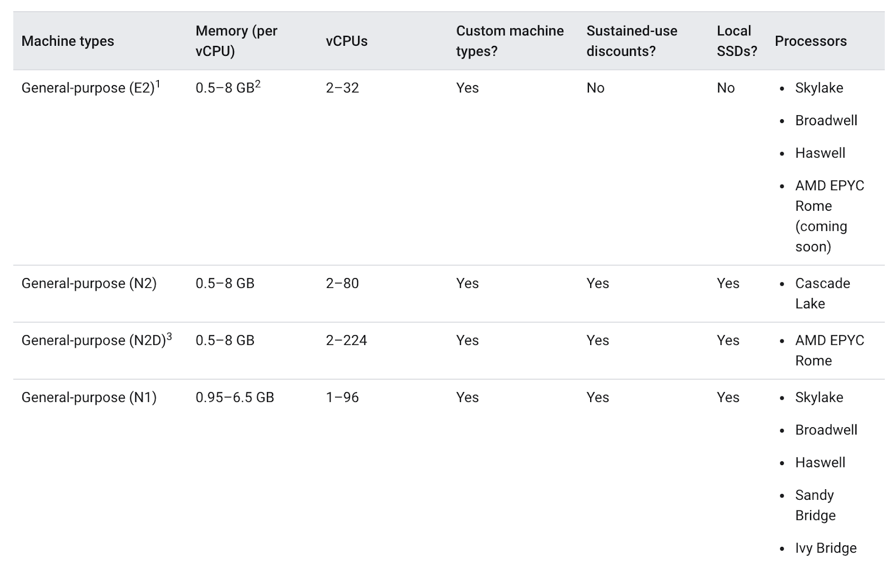
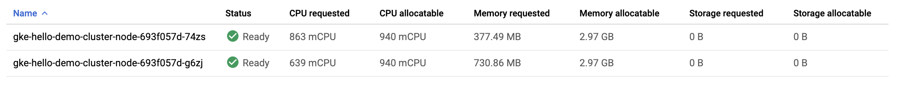
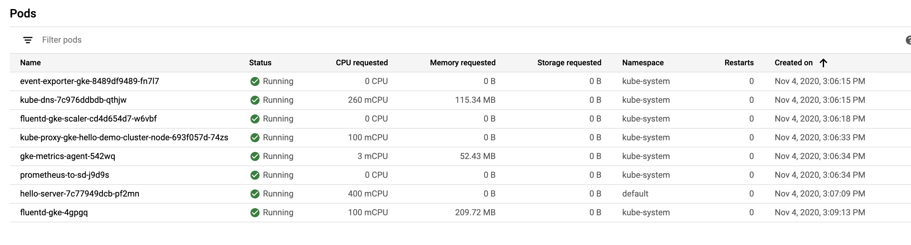
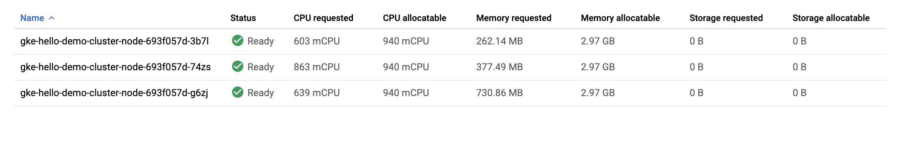
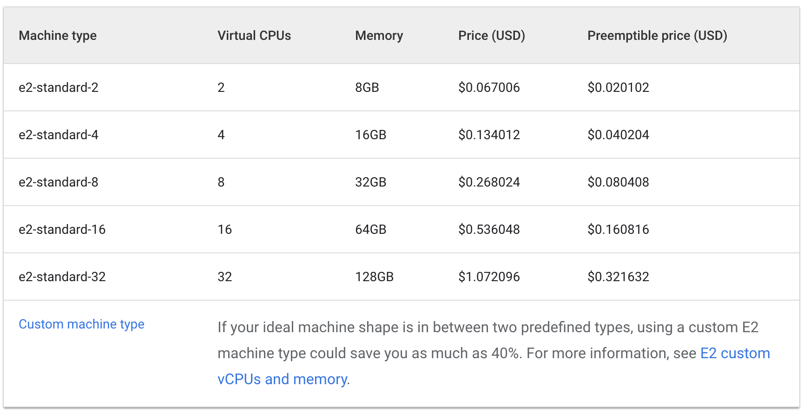
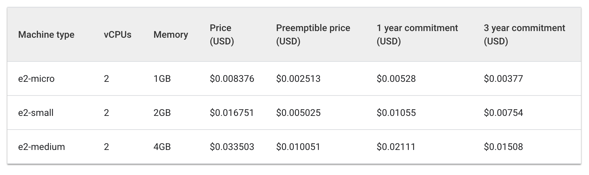
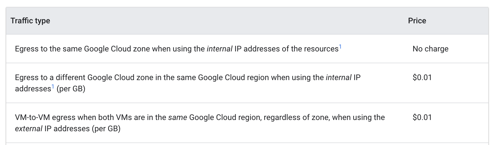

# Q6 - Exploring Cost-optimization for GKE Virtual Machines
This lab is guided and full instructions can be found in the following [link](https://www.cloudskillsboost.google/focuses/15577?parent=catalog).<br>
This documentation is an interpreted shortened version of my own attempt at this setup.

---
## Overview
* Examine Resource Usage of a Deployment
* Scale Up a Deployment
* Migrate Your Workload to a Node Pool with an Optimized Machine Type
* Explore Location Options for your Cluster
* Monitor Flow Logs between Pods in Different Zones
* Move a Chatty Pod to Minimize Cross-Zonal Traffic Costs

---
## 1. Understanding Node Machine Types
In general, E2s have similar performance to N1s but are optimized for cost. Usually, utilizing the E2 machine type alone can help save on costs.

However, with a cluster, it's most important that the resources utilized are optimized based on your application’s needs. For bigger applications or deployments that need to scale heavily, it can be cheaper to stack your workloads on a few optimized machines rather than spreading them across many general purpose ones.<br>


---
## 2. Choosing the Right Machine Type for the Hello App
Hello App is the demo application already running on pre-loaded cluster with 2 E2 medium nodes.<br>
In the **Kubernetes Clusters** window, select the **hello-demo-cluster**. Then select **Nodes** tab, we would see the CPU and memory utilization of clusters. <br>


We can as well view the **workloads** with respective **pods** information. <br>


It takes two E2-medium nodes to run one replica of your Hello-App along with the essential kube-system services. Also, while you're using most of the cluster's cpu resources, you're only using about 1/3rd of its allocatable memory.
If the workload for this app were completely static, you could create a machine type with a custom fitted shape that has the exact amount of cpu and memory needed. By doing this, you would consequently save costs on your overall cluster infrastructure.

---
## 2.1 Scale Up Hello App
The following demo will fail, purposely, to demonstrate that the current  2 nodes in cluster does not have sufficient CPU power to scale.
```
gcloud container clusters get-credentials hello-demo-cluster --zone us-central1-a
kubectl scale deployment hello-server --replicas=2
```

Hence, we scale the nodes to 3.
```
gcloud container clusters resize hello-demo-cluster --node-pool node \
    --num-nodes 3 --zone us-central1-a
```

We now take a glance at how the resources are being utilized.<br>


There's room for optimization here. At this point, if you continued to scale up the app, you would start to see a similar pattern. Kubernetes would attempt to find a node for each new replica of the hello-server deployment, fail, and then create a new node with roughly 600m of cpu.

### The Binpacking Problem
Current demo setup employed inefficient binpacking. For simplicity, this lab focuses on optimizing one application. In reality, your Kubernetes cluster will likely be running many applications with varying requirements. Kubernetes has tools to help you match your application workloads to various machines Kubernetes has access to. You can use multiple GKE Node Pools to have one Kubernetes cluster manage multiple machine types.<br>
[Further read & a python script for optimizing simple binpacking.](https://developers.google.com/optimization/bin/bin_packing)

### Migrate to optimized node pool
Instead of keep increasing the node pool, we create a pool with more cpu efficient machines
```
gcloud container node-pools create larger-pool \
  --cluster=hello-demo-cluster \
  --machine-type=e2-standard-2 \
  --num-nodes=1 \
  --zone=us-central1-a
```

Migrate the pools:
1. Cordon the existing node pool: This operation marks the nodes in the existing node pool (node) as unschedulable. Kubernetes stops scheduling new Pods to these nodes once you mark them as unschedulable.
2. Drain the existing node pool: This operation evicts the workloads running on the nodes of the existing node pool (node) gracefully.

Cordon the original node pool
```
for node in $(kubectl get nodes -l cloud.google.com/gke-nodepool=node -o=name); do
  kubectl cordon "$node";
done
```

Then drain the pool and check if the pods had moved to the larger pool. Delete the smaller node only after succyessful migration:
```
for node in $(kubectl get nodes -l cloud.google.com/gke-nodepool=node -o=name); do
  kubectl drain --force --ignore-daemonsets --delete-local-data --grace-period=10 "$node";
done
kubectl get pods -o=wide
gcloud container node-pools delete node --cluster hello-demo-cluster --zone us-central1-a
```
### Cost Analysis behind the migration
Standard machine cost:<br>


Shared core cost:<br>


The cost of three e2-medium shared-core machines would be about $0.1 an hour while one e2-standard-2 is listed at about $0.067 an hour. See the price difference and multiple that to a year that would be hundreds of dollars.

---
## 3. Selecting the Appropriate Location for a Cluster
Key factors when considering a region or zone:
1. **Handling Failures** - If your resources for your app are only distributed in one zone and that zone becomes unavailable, your app will also become unavailable. For larger scale, high demand apps it's often best practice to distribute resources across multiple zones or regions in order to handle failures.

2. **Decreased Network Latency** - To decrease network latency, you might want to choose a region or zone that is close to your point of service. For example, if you mostly have customers on the East Coast of the US, then you might want to choose a primary region and zone that is close to that area.

For many cases, prioritizing availability in your cluster through a multi-zonal or regional cluster results in the best cost-to-performance architecture.

Multi-zonal vs Regional Clusters:
* A multi-zonal cluster has at least one additional zone defined but only has a single replica of the control plane running in a single zone. Workloads can still run during an outage of the control plane's zone, but no configurations can be made to the cluster until the control plane is available.

* A regional cluster has multiple replicas of the control plane, running in multiple zones within a given region. Nodes also run in each zone where a replica of the control plane runs. Regional clusters consume the most resources but offer the best availability.

---
## 4. Managing a Regional Cluster
This demo will create two pods each on separate nodes with spec podAntiAffinity. <br>
When the pods reside at different nodes, When we ping from Pod1 to Pod2, the latency averages at 0.25ms return.
Delete Pod 2, modify it to podAffinity to pod 1.
When the pods reside in same nodes, the pint latency averages at 0.076ms.

Create pod 1 deployment manifest
```
cat << EOF > pod-1.yaml
apiVersion: v1
kind: Pod
metadata:
  name: pod-1
  labels:
    security: demo
spec:
  containers:
  - name: container-1
    image: gcr.io/google-samples/hello-app:2.0
EOF
```

Create pod 2 deployment manifest
```
cat << EOF > pod-2.yaml
apiVersion: v1
kind: Pod
metadata:
  name: pod-2
spec:
  affinity:
    podAntiAffinity:
      requiredDuringSchedulingIgnoredDuringExecution:
      - labelSelector:
          matchExpressions:
          - key: security
            operator: In
            values:
            - demo
        topologyKey: "kubernetes.io/hostname"
  containers:
  - name: container-2
    image: gcr.io/google-samples/node-hello:1.0
EOF
```

We create a separate cluster, then create Pod 1 and Pod 2
```
gcloud container clusters create regional-demo --region=us-central1 --num-nodes=1
kubectl apply -f pod-1.yaml
kubectl apply -f pod-2.yaml
kubectl get pod pod-1 pod-2 --output wide
```

Execute interactive shell into pod 1 and ping your pod 2
```
kubectl exec -it pod-1 -- sh
ping [POD-2-IP]:8080
```

### Examine the flow logs
1. Navigate to **VPC Networks**, Enable flow logs for subnet **Us-Central1** and save.
2. Then **View flow logs**.
3. From the **monitoring** page, Create Sink to BigQuery Dataset. Create a New BigQuery Dataset, give it a name.
4. Once data reaches the dataset, can query as follows. We should see cross zones traffic.
```
SELECT jsonPayload.src_instance.zone AS src_zone, jsonPayload.src_instance.vm_name AS src_vm, jsonPayload.dest_instance.zone AS dest_zone, jsonPayload.dest_instance.vm_name FROM `qwiklabs...
...
```

### To put Pod 2 back together into the same node as Pod 1
Change the following settings to pod 2 and run the commands. PodAffinity settings cannot be changed with the pod still running, hence we delete the pods first. After recreation in the same node, then we can test the ping again (lower latency). Subsequently monitor Bigquery for internodal traffic.
```
sed -i 's/podAntiAffinity/podAffinity/g' pod-2.yaml
kubectl delete pod pod-2
kubectl create -f pod-2.yaml
kubectl get pod pod-1 pod-2 --output wide
kubectl exec -it pod-1 -- sh
ping [POD-2-IP]:8080
```

### Cost Analysis for case above
When the pods were pinging each other from different zones, it was costing $0.01 per GB.<br>


---
## END
---