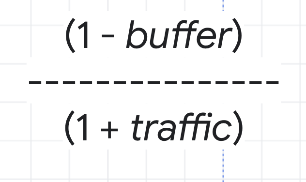
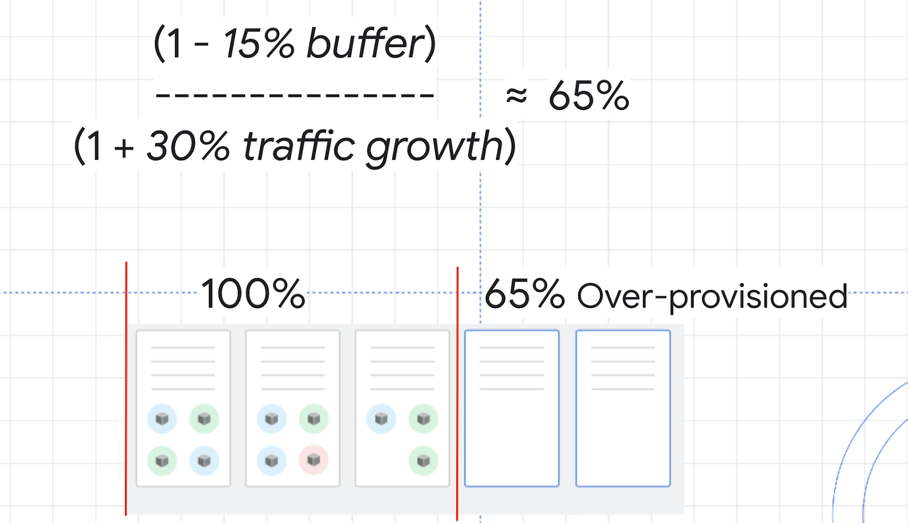

# Q6 - Understanding and Combining GKE Autoscaling Strategies
This lab is guided and full instructions can be found in the following [link to lab.](https://www.cloudskillsboost.google/focuses/15636?parent=catalog)
This documentation is an interpreted shortened version of my own attempt at this setup.<br>
This lab is a good demo on optimization of pods, nodes and clusters.
## Objectives
- Decrease number of replicas for a Deployment with Horizontal Pod Autoscaler
- Decrease CPU request of a Deployment with Vertical Pod Autoscaler
- Decrease number of nodes used in cluster with Cluster Autoscaler
- Automatically create an optimized node pool for workload with Node Auto Provisioning
- Test the autoscaling behavior against a spike in demand
- Overprovision your cluster with Pause Pods
---
## 0. Setup
Create a default 3node cluster named ***scaling-demo*** for test env to demo horizontal pod autoscaling. We'll be running ***php-apache*** deployments
```
gcloud config set compute/zone us-central1-a
gcloud container clusters create scaling-demo --num-nodes=3 --enable-vertical-pod-autoscaling
```
Create a manifest for the ***php-apache*** deployment:
```
cat << EOF > php-apache.yaml
apiVersion: apps/v1
kind: Deployment
metadata:
  name: php-apache
spec:
  selector:
    matchLabels:
      run: php-apache
  replicas: 3
  template:
    metadata:
      labels:
        run: php-apache
    spec:
      containers:
      - name: php-apache
        image: k8s.gcr.io/hpa-example
        ports:
        - containerPort: 80
        resources:
          limits:
            cpu: 500m
          requests:
            cpu: 200m
---
apiVersion: v1
kind: Service
metadata:
  name: php-apache
  labels:
    run: php-apache
spec:
  ports:
  - port: 80
  selector:
    run: php-apache
EOF
```

THen apply the manifest and then inspect the deployment. We would see 3 replicas of the deployment.
```
kubectl apply -f php-apache.yaml
kubectl get deployment
```

---
## 1.1 Scale pods with Horizontal Pod Autoscaling
Apply autoscaling with `kubectl autoscale deployment` command. Then check the state of HPA. The following attributes specify that HPA will adjust the number of replicas (via the deployment) to maintain an average CPU utilization of 50% across all pods, with a min of 1 & a max of 10 pods.
```
kubectl autoscale deployment php-apache --cpu-percent=50 --min=1 --max=10
kubectl get hpa
```

---
## 1.2 Scale size of pods with Vertical Pod Autoscaling
During setup, VPA has been enabled during creation of cluster. VPA can be enabled on existing cluster with `gcloud container clusters update <name of cluster> --enable-vertical-pod-autoscaling`. Verify VPA has been running.
```
gcloud container clusters describe scaling-demo | grep ^verticalPodAutoscaling -A 1
```

We first create a new deployment ***hello-server*** with a small sample app in cluster, requesting CPU request of *450m*.
```
kubectl create deployment hello-server --image=gcr.io/google-samples/hello-app:1.0
kubectl get deployment hello-server
kubectl set resources deployment hello-server --requests=cpu=450m
kubectl describe pod hello-server | sed -n "/Containers:$/,/Conditions:/p"
```

Then create ***Vertical Pod Autoscaler*** manifest targeting  ***hello-server*** deployment with an Update Policy of ***Off***.
`spec.updatePolicy.updateMode` attribute have 3 options as follows:
|option|definition|
|-|-|
|Off|this policy means VPA will generate recommendations based on historical data which you can manually apply.|
|Initial|VPA recommendations will be used to create new pods once and then won't change the pod size after.|
|Auto|pods will regularly be deleted and recreated to match the size of the recommendations.|

```
cat << EOF > hello-vpa.yaml
apiVersion: autoscaling.k8s.io/v1
kind: VerticalPodAutoscaler
metadata:
  name: hello-server-vpa
spec:
  targetRef:
    apiVersion: "apps/v1"
    kind:       Deployment
    name:       hello-server
  updatePolicy:
    updateMode: "Off"
EOF
```
Apply the manifest.
```
kubectl apply -f hello-vpa.yaml
```

Run `kubectl describe vpa` command to see outputs of recommendations. You can run it a few times after a period of time. The recommender with give out different values:
|Output|Definition|
|-|-|
|Lower Bound|this is the lower bound number VPA looks at for triggering a resize. If your pod utilization goes below this, VPA will delete the pod and scale it down.|
|Target|this is the value VPA will use when resizing the pod.|
|Uncapped Target|if no minimum or maximum capacity is assigned to the VPA, this will be the target utilization for VPA.|
|Upper Bound|this is the upper bound number VPA looks at for triggering a resize. If your pod utilization goes above this, VPA will delete the pod and scale it up.|

```
kubectl describe vpa hello-server-vpa
```
**Note**: Vertical Pod Autoscaling bases its recommendations on historical data from the container. In practice, it's recommended to wait at least 24 hours to collect recommendation data before applying any changes.<br>

### Forcing VPA to take effect
In order to observe VPA and its effects within this lab, you will change the hello-vpa update policy to Auto and observe the scaling.
Update ***Vertical Pod Autoscaler*** manifest with an Update Policy of ***Auto***.
```
sed -i 's/Off/Auto/g' hello-vpa.yaml
kubectl apply -f hello-vpa.yaml
```
In order to resize a pod, Vertical Pod Autoscaler will need to delete that pod and recreate it with the new size. By default, to avoid downtime, VPA will not delete and resize the last active pod. Because of this, you will need at least 2 replicas to see VPA make any changes.<br>
Scale **hello-server** deployment to 2 replicas and watch the pods being recreated.
```
kubectl scale deployment hello-server --replicas=2
kubectl get pods -w
```
This is a sign that your VPA is deleting and resizing your pods. Once you see this, press **Ctrl + c** to quit the command.

---
## 1.3 Verify the results from tweaking the HPA and VPA
Horizontal Pod Autoscaler will have most likely scaled your php-apache deployment down.
```
kubectl get hpa
```
Now, the VPA should have resized your pods in the hello-server deployment. Inspect your pods:
```
kubectl describe pod hello-server | sed -n "/Containers:$/,/Conditions:/p"
```
Takeway for VPA:
VPA excellent for optimizing CPU resources. With the Auto update policy, your VPA would continue to delete and resize the pods of the hello-server deployment throughout its lifetime. It could scale pods up with larger requests to handle heavy traffic and then scale back down during a downtime. This can be great for accounting for steady increases of demand for your application, but it does risk losing availability during heavy spikes.

Depending on your application, it's generally safest to use VPA with the **Off** update policy and take the recommendations as needed in order to both optimize resource usage and maximize your cluster's availability.

---
## 2.0 Cluster autoscaling (add or remove nodes based on demand)
Enable autoscaling on cluster. 
```
gcloud beta container clusters update scaling-demo --enable-autoscaling --min-nodes 1 --max-nodes 5
```
Theres a tradeoff:
optimize for utilization vs availability of resources.<br>

Two autoscaling profiles:
|option|definition|
|-|-|
|Balanced|The default profile|
|Optimize-utilization|Prioritize optimizing utilization over keeping spare resources in the cluster. When selected, the cluster autoscaler scales down the cluster more aggressively. It can remove more nodes, and remove nodes faster. This profile has been optimized for use with batch workloads that are not sensitive to start-up latency.|

Switch to `optimize-utilization` profile:
```
gcloud beta container clusters update scaling-demo \
--autoscaling-profile optimize-utilization
```
Despite enabling `optimize-utilization`, the nodes are not scaled down due to kube-system pods running across the nodes. These deployments under `kube-system` namespace allow monitoring, logging services to work and will not be taken offline by autoscaler. We can verify with the following command:
```
kubectl get deployment -n kube-system
```

In this lab situation, cluster will need to be scale down and optimized utilization of CPU and reschedule the pods into clusters.
By default, most of the system pods from these deployments will prevent cluster autoscaler from taking them completely offline to reschedule them. Generally, this is desired because many of these pods collect data used in other deployments and services. For example, metrics-agent being temporarily down would cause a gap in data collected for VPA and HPA, or the fluentd pod being down could create a gap in your cloud logs.

Hence we define the **Pod Disruption Budgets (PDB)** on how Kubernetes should handle disruptions like upgrades, pod removals, running out of resources, etc. In PDBs, you can specify the ***max-unavailable*** and/or the ***min-available*** number of pods a deployment should have.

We create the PDB for each `Kube-system` pods. Here we are specifying that there can be 1 unavailable pod for each of these deployments. This will allow the autoscaler to reschedule the system pods.
```
kubectl create poddisruptionbudget kube-dns-pdb --namespace=kube-system --selector k8s-app=kube-dns --max-unavailable 1
kubectl create poddisruptionbudget prometheus-pdb --namespace=kube-system --selector k8s-app=prometheus-to-sd --max-unavailable 1
kubectl create poddisruptionbudget kube-proxy-pdb --namespace=kube-system --selector component=kube-proxy --max-unavailable 1
kubectl create poddisruptionbudget metrics-agent-pdb --namespace=kube-system --selector k8s-app=gke-metrics-agent --max-unavailable 1
kubectl create poddisruptionbudget metrics-server-pdb --namespace=kube-system --selector k8s-app=metrics-server --max-unavailable 1
kubectl create poddisruptionbudget fluentd-pdb --namespace=kube-system --selector k8s-app=fluentd-gke --max-unavailable 1
kubectl create poddisruptionbudget backend-pdb --namespace=kube-system --selector k8s-app=glbc --max-unavailable 1
kubectl create poddisruptionbudget kube-dns-autoscaler-pdb --namespace=kube-system --selector k8s-app=kube-dns-autoscaler --max-unavailable 1
kubectl create poddisruptionbudget stackdriver-pdb --namespace=kube-system --selector app=stackdriver-metadata-agent --max-unavailable 1
kubectl create poddisruptionbudget event-pdb --namespace=kube-system --selector k8s-app=event-exporter --max-unavailable 1
```
Once the nodes are down scaled, we can verify the number of nodes again.
```
kubectl get nodes
```

**Note**: It’s important to note that, while **Cluster Autoscaler** removed an unnecessary node, **Vertical Pod Autoscaling** and **Horizontal Pod Autoscaling** helped reduce enough CPU demand so that the node was no longer needed. Combining these tools is a great way to optimize your overall costs and resource usage.

---
## 2.1 Node Auto Provisioning
Node Auto Provisioning (NAP) actually adds new node pools that are sized to meet demand. Without node auto provisioning, the cluster autoscaler will only be creating new nodes in the node pools you've specified, meaning the new nodes will be the same machine type as the other nodes in that pool. <br>
Enable node auto provisioning
```
gcloud container clusters update scaling-demo \
    --enable-autoprovisioning \
    --min-cpu 1 \
    --min-memory 2 \
    --max-cpu 45 \
    --max-memory 160
```

This is perfect for helping optimize resource usage for batch workloads and other apps that don't need extreme scaling.

---
## 3.0 Run artificial load on deployments to Test with Larger Demands
Open a new shell terminal and create artificial load on `php-apache` pods.
```
kubectl run -i --tty load-generator --rm --image=busybox --restart=Never -- /bin/sh -c "while sleep 0.01; do wget -q -O- http://php-apache; done"
```
We can monitor the load and see HPA scales horizontally, & also notice how cluster handles increased workloads:
```
kubectl get hpa -w
kubectl get deployment php-apache
```

**Note**: The steps of events happening when load is up.
* First, your `php-apache` deployment will automatically be scaled up by **HPA** to handle the increased load.
* Then, **cluster autoscaler** will need to provision new nodes to handle the increased demand.
* Finally, **node auto provisioning** will create a node pool optimized for the CPU and memory requests of your cluster’s workloads. In this case, it should be a high cpu, low memory node pool because the load test is pushing the cpu limits.
* All of these processes during my test took ***at least 4~5 minutes*** for the new nodes to be scaled up and poised as a challenge for ***apps losing availability*** while new resources are being provisioned. Hence on next task we introduce buffer and pause pods to mitigate these problems.

---
## 3.1 Optimize larger loads
From our previous scaling test, scaling takes times if:
* a node that hasn't deployed your application before, a bit of time might be added if it needs to download the container images before running it.
* don't have enough room on your existing nodes and you're using the cluster autoscaler.
* the node auto-provisioner is going to create a new node pool like it did in your cluster.

### Strategy in theory: Over Provision
To overcome these latencies, we would **over provision** resources to handle it. Use the following formula:


As an example, think about the CPU utilization for your cluster. You don't want it to hit 100%, so you could choose a buffer of 15% to keep a safe distance. Then, the traffic variable in the formula would be the percentage of traffic growth estimated in the next 2 to 3 minutes. In the load test you ran earlier, 0% to 150% was a bit of an extreme growth example, so instead imagine a more average traffic growth of 30%.


With these numbers, you can calculate a safety buffer of about 65%. That means you might want to over provision your resources by about 65% in order to handle scale ups while minimizing any issues.

### Strategy in practise: Use Pause Pods
**Pause Pods** are low priority deployments which are able to be removed and replaced by high priority deployments. This means you can create low priority pods which don't actually do anything except ***reserve buffer space***. When the higher-priority pod needs room, the pause pods will be removed and rescheduled to another node, or a new node, and the higher-priority pod has the room it needs to be scheduled quickly.

Create a manifest for a pause pod:
```
at << EOF > pause-pod.yaml
---
apiVersion: scheduling.k8s.io/v1beta1
kind: PriorityClass
metadata:
  name: overprovisioning
value: -1
globalDefault: false
description: "Priority class used by overprovisioning."
---
apiVersion: apps/v1
kind: Deployment
metadata:
  name: overprovisioning
  namespace: kube-system
spec:
  replicas: 1
  selector:
    matchLabels:
      run: overprovisioning
  template:
    metadata:
      labels:
        run: overprovisioning
    spec:
      priorityClassName: overprovisioning
      containers:
      - name: reserve-resources
        image: k8s.gcr.io/pause
        resources:
          requests:
            cpu: 1
            memory: 4Gi
EOF
```

And apply the changes
```
kubectl apply -f pause-pod.yaml
```

---
## END
---