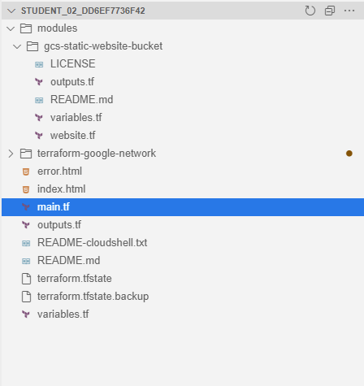

# Q4 - Interact with Terraform Modules
This lab is guided and full instructions can be found in the following [link to lab.](https://www.cloudskillsboost.google/focuses/15836?parent=catalog)<br>
This documentation is an interpreted shortened version of my own attempt at this setup.
---
## Overview
- Demo on how to use a module from the Registry

- Build a module
---
## 1. Use modules from the Terraform Registry (pre-made templates)
Where to download modules?:
[Git Repo terraform-google-modules](https://github.com/terraform-google-modules) or 
[Terraform Registry](https://registry.terraform.io/)

Clone the modules from github repo to shell and switch to the v3.3.0 branch
```
git clone https://github.com/terraform-google-modules/terraform-google-network
cd terraform-google-network
git checkout tags/v3.3.0 -b v3.3.0
```

Create resources with [/terraform-google-network/examples/simple_project/main.tf file](./student_02_dd6ef7736f42/terraform-google-network/examples/simple_project/main.tf)


Create resources with [/terraform-google-network/examples/simple_project/variables.tf file](./student_02_dd6ef7736f42/terraform-google-network/examples/simple_project/variables.tf) and fill in "name" and "project ID"

Create resources with [/terraform-google-network/examples/simple_project/outputs.tf file](./student_02_dd6ef7736f42/terraform-google-network/examples/simple_project/outputs.tf)

Change directory and provision infrastructure
```
cd ~/terraform-google-network/examples/simple_project
terraform init
terraform apply
```
---
## 2. Build our own module (root at /home/student_02_dd6ef7736f42)
The directory is created as such following the image.



While module directory structure should look like this:
```
modules/
└── gcs-static-website-bucket
    ├── LICENSE
    ├── README.md
    ├── website.tf
    ├── outputs.tf
    └── variables.tf
```

This example we build a storage bucket.
Switch to root dir, one main.tf, another 3 files in path `modules/gcs-static-website-bucket`
```
cd ~
touch main.tf
touch variables.tf
touch outputs.tf

mkdir -p modules/gcs-static-website-bucket

cd modules/gcs-static-website-bucket
touch website.tf
touch variables.tf
touch outputs.tf
echo "# GCS static website bucket \
 This module provisions Cloud Storage buckets configured for static website hosting." > README.md
touch LICENSE
```

Then we install the local module
```
terraform init
terraform apply
```

And finally test the bucket
```
cd ~
curl https://raw.githubusercontent.com/hashicorp/learn-terraform-modules/master/modules/aws-s3-static-website-bucket/www/index.html > index.html
curl https://raw.githubusercontent.com/hashicorp/learn-terraform-modules/blob/master/modules/aws-s3-static-website-bucket/www/error.html > error.html
gsutil cp *.html gs://YOUR-BUCKET-NAME
```
---
## END
---
