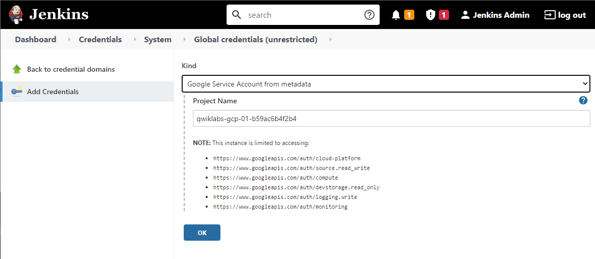
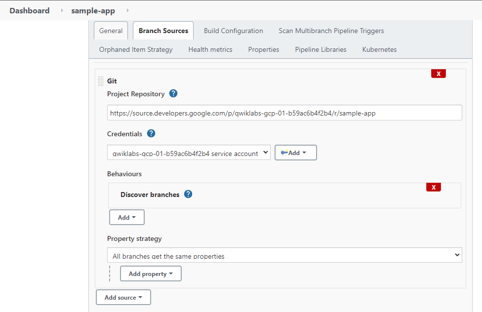
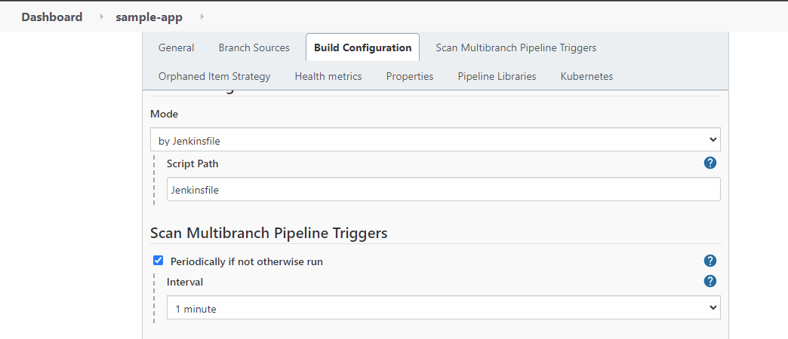
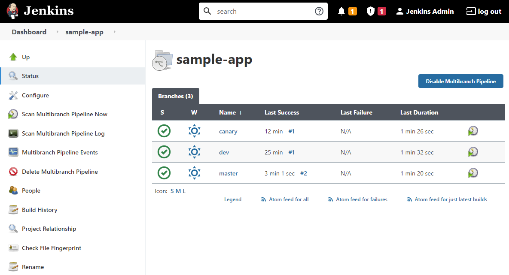

# Implement DevOps in Google Cloud: Challenge Lab
[link to challenge lab](https://www.cloudskillsboost.google/focuses/13287?parent=catalog)<br>
As this challenge is to test our familiarity with CICD pipeline, all automation code, e.g. Jenkinsfile, deployments, etc., are provided by Google.

## Working standards for the lab
- region = us-east1
- zone = us-east1-b
- use project VPC
- naming convention example = kraken-webserver1
- n1-standard-1 for cost savings

The lab resources are provisioned in advance for lab purposes. Example, clusters and nodes are provisioned with Jenkins installed. So we only need to connect to the clusters.
```
gcloud container clusters get-credentials jenkins-cd
```
If just in case jenkins is not configured, or service account is not configured. We can run the installation below. An alternative installation can be found inside a shell script in a directory `/work/sample-app` on `Kraken-jumphost`.
```
helm repo add jenkins https://charts.jenkins.io
helm repo update
gsutil cp gs://spls/gsp330/values.yaml jenkins/values.yaml
helm install cd jenkins/jenkins -f jenkins/values.yaml --wait
kubectl create clusterrolebinding jenkins-deploy --clusterrole=cluster-admin --serviceaccount=default:cd-jenkins
```

## Task 1: Configure a Jenkins pipeline for continuous deployment to Kubernetes Engine
Create multibranch pipeline, deploy **sample-app** in **kraken-vpc**
- VPC = kraken-vpc
- cluster =jenkins-cd
- namespace = production, canary, dev

0. Create namespaces for production. But if this step is missed, it will be configured automatically by instructions in the Jenkinsfile.
```
kubectl create ns production
```

1. Configure kubectl proxy to access the Jenkins UI, then web-preview in a browser tab.
```
export POD_NAME=$(kubectl get pods --namespace default -l "app.kubernetes.io/component=jenkins-master" -l "app.kubernetes.io/instance=cd" -o jsonpath="{.items[0].metadata.name}")
kubectl port-forward $POD_NAME 8080:8080 >> /dev/null &
```

2. Retrieve and decode the Jenkins Admin password (key name jenkins-admin-password) for your deployment from the Kubernetes secret (secret name cd-jenkins) for the Jenkins deployment.
It will return a string of password for Jenkins UI login. Username = admin.
```
printf $(kubectl get secret cd-jenkins -o jsonpath="{.data.jenkins-admin-password}" | base64 --decode);echo
```

3. Configure Jenkins to get the build credentials required from the metadata available on the Kubernetes Engine nodes. The cluster has been deployed using a service account that has the required read and write access to Cloud Source Repositories.<br>
<br>

4. Configure a multibranch (as shown in image below) Jenkins pipeline job using the Jenkinsfile Jenkins job configuration file included in the root of the sample-app repository.<br>
<br>

5. Configure the Jenkins job to check for new branches / repository updates every minute.<br>
<br>

6. Jenkins would detect the changes and triggers a build on master branch. We just have to wait for the build to be completed.

---
## Task 2: Push an update to the application to a development branch
1. Create a new development branch with a corresponding Kubernetes namespace. 
Using the cloud shell, we can create any namespace name such as "dev" as long as it matches the branch name in repository.
```
kubectl create ns dev
```

2. SSH to `kraken-jumphost` and go to directory `/work/sample` to make new branch. The jumphost has already cloned the repo's master branch.
```
sudo git checkout -b dev
```
Then edit the file main.go in the root folder of the repo and change the version number to `2.1.0`
`const version string = "2.1.0"`

Next, edit the file html.go in the root folder of the repo and change both lines that contains the word `blue` to `red` .
`<div class="card red">`
These two changes will be treated as a version update to the app.

3. Once the files have been changed and the namespace exists, you can commit your changes to the development branch and push those changes to the repository.Commit and push to dev branch.
```
git status
git commit -am "revision 2.1.0"
git push origin dev
```

4. Check if changes has been made either by curl or kube proxy. It should return the amended version of the web application deployed in the development namespace. The development namespace pods are not exposed to public IP and is set as a clusterIP. `fg` and exit proxy when done.
```
kubectl proxy &
curl \
http://localhost:8001/api/v1/namespaces/dev/services/gceme-frontend:80/proxy/version
```

Remarks: For step 2, I wasn't able to get the green checkmark initially immediately after completing this step. Until i have completed deploying all 3 branches succesfully, then only I receive the green checkmark.

---
## Task 3: Push a Canary deployment to the production namespace
Now create a new branch called canary, merge the development branch with it, and push that to the repository.
```
sudo git checkout -b canary
sudo git merge dev
sudo git push origin canary
```
Once the build is deployed, check for version of web frontend by doing a curl request
```
export FRONTEND_SERVICE_IP=$(kubectl get -o \
jsonpath="{.status.loadBalancer.ingress[0].ip}" --namespace=production services gceme-frontend)
while true; do curl http://$FRONTEND_SERVICE_IP/version; sleep 1; done
```
At least one fifth of the time, the response would be from the canary deployments.

---
## Task 4: Promote the Canary Deployment to production
Merge the Canary branch with master in order to trigger a Jenkins build for the updated master branch.
```
sudo git checkout master
sudo git merge canary
sudo git push origin master
```
At last, we would have deployed three different branches pipeline builds.<br>
<br>

---
## END
---