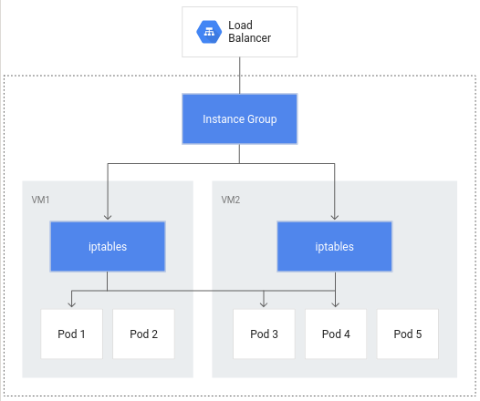

# GKE Workload Optimization
This lab is guided and full instructions can be found in the following [link](https://www.cloudskillsboost.google/focuses/15706?parent=catalog).<br>
This documentation is an interpreted shortened version of my own attempt at this setup.
We'll be using qwiklabs provisioned GCP lab environment with cloud shell CLI.
---
## Overview and Objectives of the demo
- Configure container-native load balancing for load balancing through ingress for more efficient routing to your pods

- Walk through a single-pod load test of a Kubernetes application for understanding app load capacity

- Configure a liveness probe for a Kubernetes application in order to define meaningful prerequisite conditions for automatic pod reboots

- Configure a readiness probe for a Kubernetes application in order to ensure that traffic reaches the application endpoints successfully

- Configure a Pod Disruption Budget for ensuring application availability
---
## 0. Setup
Setup a 3node zonal cluster with flag `--enable-ip-alias`. It will be neede for container-native load balancing through an ingress. This eliminates the use of iptables in a normal k8s architecture (also eliminates the double hop issue). Each individual pods will be assigned an secondary IP and received traffic directly from Ingress controller. Refer to images in next section for architecture diagram reference.

```
gcloud config set compute/zone us-central1-a
gcloud container clusters create test-cluster --num-nodes=3  --enable-ip-alias
```
Create sample web app manifest named ***gb-frontend*** in a single pod.
```
cat << EOF > gb_frontend_pod.yaml
apiVersion: v1
kind: Pod
metadata:
  labels:
    app: gb-frontend
  name: gb-frontend
spec:
    containers:
    - name: gb-frontend
      image: gcr.io/google-samples/gb-frontend:v5
      resources:
        requests:
          cpu: 100m
          memory: 256Mi
      ports:
      - containerPort: 80
EOF
```
Then apply manifest.
```
kubectl apply -f gb_frontend_pod.yaml
```
---
## 1. Container-native Load Balancing Through Ingress
Normal architecture with iptables routing traffice:<br>


Container-native load balancing architecture:<br>


Now the app in the pod has been created, we create a service type `ClusterIP` to expose the app to receive routed traffic. ( ***What is ClusterIP?*** ClusterIP exposes the service on an IP address that is only accessible from within this cluster. This is the default type.)
```
cat << EOF > gb_frontend_cluster_ip.yaml
apiVersion: v1
kind: Service
metadata:
  name: gb-frontend-svc
  annotations:
    cloud.google.com/neg: '{"ingress": true}'
spec:
  type: ClusterIP
  selector:
    app: gb-frontend
  ports:
  - port: 80
    protocol: TCP
    targetPort: 80
EOF
```
The manifest includes an `annotations` field where the annotation for `cloud.google.com/neg` will enable container-native load balancing on for your application when an ingress is created.
Apply the service manifest:
```
kubectl apply -f gb_frontend_cluster_ip.yaml
```
Now we can create ingress controller. ( ***What is Ingress?*** Ingress operates at L7; a collection of rules that direct external inbound connections to a set of services within the cluster.)
```
cat << EOF > gb_frontend_ingress.yaml
apiVersion: networking.k8s.io/v1beta1
kind: Ingress
metadata:
  name: gb-frontend-ingress
spec:
  backend:
    serviceName: gb-frontend-svc
    servicePort: 80
EOF
```
and apply he manifest.
```
kubectl apply -f gb_frontend_ingress.yaml
```
When the ingress is created, an HTTP(S) load balancer is created along with an NEG (Network Endpoint Group) in each zone in which the cluster runs. After a few minutes, the ingress will be assigned an external IP.<br>

The load balancer it created has a backend service running in your project that defines how Cloud Load Balancing distributes traffic. This backend service has a health status associated with it. To check the health status of the backend service, first retrieve the name:
```
BACKEND_SERVICE=$(gcloud compute backend-services list | grep NAME | cut -d ' ' -f2)
gcloud compute backend-services get-health $BACKEND_SERVICE --global
```
Output will look like this:
```
https://www.googleapis.com/compute/v1/projects/app-load-testing/zones/us-central1-a/instances/gke-test-cluster-default-pool-0274c043-8bc4
    ipAddress: 10.0.1.23
    port: 80
  - healthState: HEALTHY
    instance: 
```
Note: These health checks are part of the Google Cloud load balancer and are distinct from the liveness and readiness probes provided by the Kubernetes API which can be used to determine the health of individual pods. The Google Cloud load balancer health checks use special routes outside of your project’s VPC to perform health checks and determine the success or failure of a backend.

Get the external IP:
```
kubectl get ingress gb-frontend-ingress
```
---
## 2. Load Testing an Application (with Locust)
To load test our pod, we'll use Locust, an open source load-testing framework. 
Download the Docker image files for Locust in our Cloud Shell.<br>
Build the Docker image for Locust and store it in your project's container registry.<br>
Then verify the image.
```
gsutil cp -r gs://spls/gsp769/locust-image .
gcloud builds submit --tag gcr.io/${GOOGLE_CLOUD_PROJECT}/locust-tasks:latest locust-image
gcloud container images list
```
we'll copy a manifest which launches a single-pod deployment for the main and a 5-replica deployment for the workers and run the UI on [EXTERNAL_IP_ADDRESS]:8089:
```
gsutil cp gs://spls/gsp769/locust_deploy_v2.yaml .
sed 's/${GOOGLE_CLOUD_PROJECT}/'$GOOGLE_CLOUD_PROJECT'/g' locust_deploy_v2.yaml | kubectl apply -f -
kubectl get service locust-main
```
For this example, to represent a typical load, enter 200 for the number of users to simulate and 20 for the hatch rate. After a few seconds, the status should read Running with 200 users and about 150 requests per second (RPS):


In the console, navigate to ***GKE***, select ***gb-frontend*** pod to view details and metrics.
An e.g. load test at about 150 requests per second, you may see the CPU utilization vary from as low as **.04** and as high as **.06**. This represents **40-60%** of your one pod's CPU request. On the other hand, memory utilization stays at around **80Mi**, well below the requested 256Mi. This is your per-pod capacity.

We can simulate a spike in traffic by entering **900** for the number of users to simulate and **300** for the hatch rate and click Start Swarming. Along with a baseline, you should also take into account how your application may perform after sudden bursts or spikes.

---
## 3. Setting up Readiness and Liveness Probes
### Setting up a liveness probe
To demonstrate a liveness probe, the following will generate a manifest for a pod that has a liveness probe based on the execution of the `cat` command on a file created on creation. with zero exit code means its successful, non-zero exit code means probe fail.
```
cat << EOF > liveness-demo.yaml
apiVersion: v1
kind: Pod
metadata:
  labels:
    demo: liveness-probe
  name: liveness-demo-pod
spec:
  containers:
  - name: liveness-demo-pod
    image: centos
    args:
    - /bin/sh
    - -c
    - touch /tmp/alive; sleep infinity
    livenessProbe:
      exec:
        command:
        - cat
        - /tmp/alive
      initialDelaySeconds: 5
      periodSeconds: 10
EOF
```
Apply the liveness probe manifest and view the events that followed.
```
kubectl apply -f liveness-demo.yaml
kubectl describe pod liveness-demo-pod
```
To simulate a liveness probe failure, we purposely remove the `/tmp/alive` file and view the events that followed.
```
kubectl exec liveness-demo-pod -- rm /tmp/alive
kubectl describe pod liveness-demo-pod | grep -A 10 'Events:'
```
This prompts a recreation of a new pod after destroying current pod.

### Setting up a readiness probe
We create a manifest to create a another separate single pod that will serve as a test webserver along with a load balancer. The readiness probe will `cat` for `/tmp/healthz/`.
```
cat << EOF > readiness-demo.yaml
apiVersion: v1
kind: Pod
metadata:
  labels:
    demo: readiness-probe
  name: readiness-demo-pod
spec:
  containers:
  - name: readiness-demo-pod
    image: nginx
    ports:
    - containerPort: 80
    readinessProbe:
      exec:
        command:
        - cat
        - /tmp/healthz
      initialDelaySeconds: 5
      periodSeconds: 5
---
apiVersion: v1
kind: Service
metadata:
  name: readiness-demo-svc
  labels:
    demo: readiness-probe
spec:
  type: LoadBalancer
  ports:
    - port: 80
      targetPort: 80
      protocol: TCP
  selector:
    demo: readiness-probe
EOF
```
Apply the pod manifest , curl to the service IP with your browser, and view the events that followed.
```
kubectl apply -f readiness-demo.yaml
kubectl get service readiness-demo-svc
kubectl describe pod readiness-demo-pod
```
Take note that an unhealthy readiness probe does not trigger the pod to restart.
To simulate a recovery in the readiness of the probe, we purpose create the `/tmp/healthz/` file.
```
kubectl exec readiness-demo-pod -- touch /tmp/healthz
kubectl describe pod readiness-demo-pod | grep ^Conditions -A 5
```
Refreshing the browser will return a working nginx webserver.
---
## 4. Pod Disruption Budgets
PodDisruptionBudget is a Kubernetes resource that limits the number of pods of a replicated application that can be down simultaneously due to voluntary disruptions.
First lets clear up single pod app
```
kubectl delete pod gb-frontend
```
create a deployment of 5 replicas:
```
cat << EOF > gb_frontend_deployment.yaml
apiVersion: apps/v1
kind: Deployment
metadata:
  name: gb-frontend
  labels:
    run: gb-frontend
spec:
  replicas: 5
  selector:
    matchLabels:
      run: gb-frontend
  template:
    metadata:
      labels:
        run: gb-frontend
    spec:
      containers:
        - name: gb-frontend
          image: gcr.io/google-samples/gb-frontend:v5
          resources:
            requests:
              cpu: 100m
              memory: 128Mi
          ports:
            - containerPort: 80
              protocol: TCP
EOF
```
Apply
```
kubectl apply -f gb_frontend_deployment.yaml
```

First we demo evacuation of pods on particular node, and observe the status of the deployment affected.
Drain the nodes by looping through the output of the default-pool's nodes and running the `kubectl drain` command on each individual node:
```
for node in $(kubectl get nodes -l cloud.google.com/gke-nodepool=default-pool -o=name); do
  kubectl drain --force --ignore-daemonsets --grace-period=10 "$node";
done
```
Most likely `gb-frontend` deployment's replica count could be down to zero because not enough room to spawn new pods.
```
kubectl describe deployment gb-frontend | grep ^Replicas
```
Now lets bring back up the pods in the nodes by un-cordoning.
```
for node in $(kubectl get nodes -l cloud.google.com/gke-nodepool=default-pool -o=name); do
  kubectl uncordon "$node";
done
kubectl describe deployment gb-frontend | grep ^Replicas
```

### Create a pod disruption budget
Declare the minimum number of available pods to be 4. Then start draining the nodes again. But this time we would note that minimum of 4 pods remaining as specified.
```
kubectl create poddisruptionbudget gb-pdb --selector run=gb-frontend --min-available 4
for node in $(kubectl get nodes -l cloud.google.com/gke-nodepool=default-pool -o=name); do
  kubectl drain --timeout=30s --ignore-daemonsets --grace-period=10 "$node";
done
kubectl describe deployment gb-frontend | grep ^Replicas
```
---
## END
---